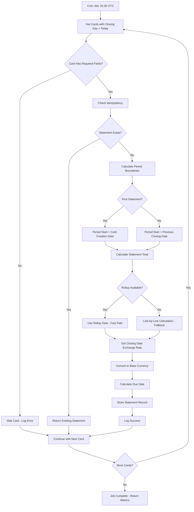
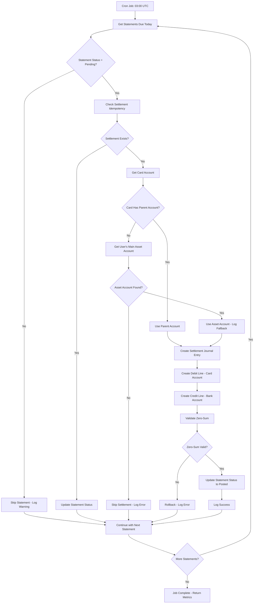

# Card Statements & Settlement Feature Documentation

## Overview

The Card Statements & Settlement feature is **Phase 5** of PerFi's accounting core migration, implementing automated card statement calculation and settlement posting using accrual accounting principles. This system transforms PerFi from manual card management to a fully automated card billing system that follows proper accounting principles.

## Table of Contents

1. [Feature Overview](#feature-overview)
2. [Architecture & Design](#architecture--design)
3. [Database Schema](#database-schema)
4. [Backend Functions](#backend-functions)
5. [Scheduled Jobs](#scheduled-jobs)
6. [Business Logic Flow](#business-logic-flow)
7. [Technical Implementation](#technical-implementation)
8. [Error Handling & Monitoring](#error-handling--monitoring)
9. [Performance Optimization](#performance-optimization)
10. [Multi-Currency Support](#multi-currency-support)
11. [Edge Cases & Fallbacks](#edge-cases--fallbacks)
12. [API Reference](#api-reference)
13. [Testing Strategy](#testing-strategy)
14. [Deployment & Operations](#deployment--operations)

## Feature Overview

### Purpose
The card statements feature automates the complete lifecycle of credit card billing:
- **Statement Calculation**: Automatically calculates card statements on closing dates
- **Settlement Posting**: Automatically posts settlement entries on due dates
- **Accrual Accounting**: Maintains proper double-entry bookkeeping for card transactions
- **Multi-Currency Support**: Handles cross-currency transactions with exchange rate conversion

### Key Benefits
- **Automation**: Eliminates manual statement calculation and settlement posting
- **Accuracy**: Ensures consistent and accurate card billing using proper accounting principles
- **Scalability**: Handles large volumes of card transactions efficiently
- **Reliability**: Idempotent operations prevent duplicate processing
- **Auditability**: Complete audit trail for all statement and settlement operations

### Business Value
- **Reduced Manual Work**: No more manual card statement calculations
- **Improved Accuracy**: Automated calculations reduce human error
- **Better Cash Flow Management**: Automated settlement posting improves financial tracking
- **Enhanced User Experience**: Users see accurate card balances and payment schedules
- **Compliance**: Proper accounting treatment for card transactions

## Architecture & Design

### System Architecture

```
┌─────────────────┐    ┌─────────────────┐    ┌─────────────────┐
│   Cron Jobs     │    │  Card Statements │    │  Journal Entries │
│                 │    │                 │    │                 │
│ 01:00 UTC      │───▶│  Statement      │───▶│  Settlement     │
│ Statement Calc │    │  Calculation    │    │  Posting        │
│                 │    │                 │    │                 │
│ 03:00 UTC      │    │                 │    │                 │
│ Settlement     │───▶│  Settlement     │───▶│  Zero-Sum       │
│ Posting        │    │  Processing     │    │  Validation     │
└─────────────────┘    └─────────────────┘    └─────────────────┘
         │                       │                       │
         ▼                       ▼                       ▼
┌─────────────────┐    ┌─────────────────┐    ┌─────────────────┐
│  Card Metadata  │    │ Monthly Rollups │    │  Error Tracking │
│                 │    │                 │    │                 │
│ • Closing Day   │    │ • Fast Lookup   │    │ • Logging       │
│ • Due Date      │    │ • Fallback      │    │ • Monitoring    │
│ • Base Currency │    │ • Performance   │    │ • Alerts        │
└─────────────────┘    └─────────────────┘    └─────────────────┘
```

### Design Principles

#### 1. **Accrual Accounting**
- Card charges create liability when incurred
- Settlement reduces liability when payment is made
- Proper debit/credit treatment for all transactions

#### 2. **Idempotency**
- All operations can be safely retried
- Unique idempotency keys prevent duplicates
- Graceful handling of concurrent operations

#### 3. **Performance First**
- Monthly rollups for fast statement calculation
- Fallback to line-by-line calculation when needed
- Optimized database indexes for efficient queries

#### 4. **Error Resilience**
- Individual failures don't stop batch processing
- Comprehensive error logging and monitoring
- Graceful degradation for missing data

#### 5. **Multi-Currency Support**
- Closing date exchange rates for consistency
- User-modifiable rates for accuracy
- Proper currency conversion handling

## Database Schema

### `card_statements` Table

The core table storing calculated card statement summaries:

```typescript
{
  // Primary Key
  _id: Id<"card_statements">,
  
  // Foreign Keys
  accountId: Id<"accounts">,        // FK to card liability account
  userId: Id<"users">,              // FK to user who owns the card
  
  // Period Information
  periodStart: number,              // epoch milliseconds (start of billing period)
  periodEnd: number,                // epoch milliseconds (end of billing period)
  closingDate: number,              // epoch milliseconds (statement closing date)
  dueDate: number,                  // epoch milliseconds (payment due date)
  
  // Financial Data
  totalAmount: number,              // signed integer in minor units (statement total)
  currencyCode: string,             // ISO 4217 currency code (e.g., "ARS", "USD")
  
  // Exchange Rate Information
  exchangeRate?: number,            // Exchange rate used for conversion (user-modifiable)
  exchangeRateId?: Id<"exchange_rates">, // Reference to official rate
  
  // Status & Processing
  status: "pending" | "posted" | "paid", // Statement processing status
  settlementEntryId?: Id<"journal_entries">, // FK to settlement entry
  
  // Idempotency & Audit
  idempotencyKey: string,           // prevents duplicate statements
  createdAt: number,               // epoch milliseconds
  updatedAt: number,               // epoch milliseconds
}
```

### Indexes

```typescript
// Query statements by card and closing date
.index("by_accountId_closingDate", ["accountId", "closingDate"])

// Query user's statements by status
.index("by_user_status", ["userId", "status"])

// Query statements due for settlement
.index("by_dueDate_status", ["dueDate", "status"])

// Prevent duplicate statement creation
.index("by_idempotencyKey", ["idempotencyKey"])
```

### Business Rules

1. **Amount Validation**: `totalAmount` must be positive (represents charges to card)
2. **Date Validation**: `dueDate` must be after `closingDate`
3. **Status Transitions**: `pending` → `posted` → `paid`
4. **Settlement Link**: `settlementEntryId` required when `status = 'posted'`
5. **Idempotency**: `idempotencyKey` must be unique across all statements

### `cards` Table

Credit card metadata used by statement calculation:

```typescript
{
  // Primary Key
  _id: Id<"cards">,

  // Foreign Keys
  accountId: Id<"accounts">,     // PK & FK to card liability account
  userId: Id<"users">,

  // Billing Settings
  closingDay: number,             // 1-31
  dueDate: number,                // 1-31

  // Optional Metadata (schema allows optional)
  baseCurrency?: string,          // ISO 4217
  createdAt?: number,             // epoch ms

  // Soft delete
  softdelete: boolean,
  deletedAt?: number,
}
```

## Backend Functions

### Core Functions

#### 1. `calculateStatement` (Internal Mutation)

**Purpose**: Calculate and store card statement for a specific closing date

**Input**:
```typescript
{
  cardAccountId: Id<"accounts">,  // card liability account
  closingDate: number,            // epoch milliseconds (closing date)
}
```

**Output**:
```typescript
{
  statementId: Id<"card_statements">, // created statement ID
  totalAmount: number,                // calculated statement total
  periodStart: number,                // billing period start
  periodEnd: number,                  // billing period end
  dueDate: number,                    // payment due date
}
```

**Algorithm**:
1. **Validate Card**: Ensure card exists and has required fields
2. **Check Idempotency**: Return existing statement if already calculated
3. **Calculate Period**: Determine billing period boundaries
4. **Calculate Amount**: Sum card transactions using rollups or fallback
5. **Get Exchange Rate**: Retrieve closing date exchange rate
6. **Calculate Due Date**: Set due date based on card's due day
7. **Store Statement**: Create statement record with all data

**Performance**:
- **Fast Path**: Uses monthly rollups (O(1) lookup)
- **Fallback Path**: Line-by-line calculation with exchange rate conversion
- **Target**: < 500ms for cards with 100 transactions

#### 2. `postSettlement` (Internal Mutation)

**Purpose**: Create settlement journal entry for a card statement

**Input**:
```typescript
{
  statementId: Id<"card_statements">, // statement to settle
}
```

**Output**:
```typescript
{
  entryId: Id<"journal_entries">,     // settlement journal entry ID
  amount: number,                    // settlement amount
  cardAccountId: Id<"accounts">,     // card account debited
  bankAccountId: Id<"accounts">,     // bank account credited
}
```

**Algorithm**:
1. **Validate Statement**: Ensure statement exists and is pending
2. **Determine Bank Account**: Use parentAccountId or fallback to main asset account
3. **Check Idempotency**: Return existing settlement if already posted
4. **Create Journal Entry**: Create settlement entry with proper metadata
5. **Create Debit Line**: Debit card account (liability decrease)
6. **Create Credit Line**: Credit bank account (asset decrease)
7. **Validate Zero-Sum**: Ensure debits = credits
8. **Update Statement**: Mark statement as posted

**Accounting Logic**:
- **Debit Card Account**: Reduces card liability (money owed decreases)
- **Credit Bank Account**: Reduces bank asset (money in bank decreases)
- **Zero-Sum Validation**: Ensures accounting equation balance

### Helper Functions

#### 3. `getClosingDateExchangeRate` (Internal Query)

**Purpose**: Get exchange rate for statement closing date with fallback logic

**Features**:
- **Exact Date Match**: Looks for rate on exact closing date
- **Recent Rate Fallback**: Uses most recent rate if no exact match
- **Ultimate Fallback**: Uses 1.0 if no rates exist
- **Comprehensive Logging**: Logs warnings for fallback usage

#### 4. `getUserMainAssetAccount` (Internal Query)

**Purpose**: Get user's primary asset account for settlement fallback

**Logic**:
- Finds user's first active asset account
- Used when card doesn't have parentAccountId
- Returns null if no asset accounts exist
- Enables settlement for orphaned cards

#### 5. `getCardsWithClosingToday` (Internal Query)

**Purpose**: Find cards with closing day = today

**Features**:
- Uses UTC date for consistent day matching
- Filters out cards missing required fields
- Returns only essential data for processing
- Handles timezone differences correctly

#### 6. `getStatementsDueToday` (Internal Query)

**Purpose**: Find statements due for settlement today

**Features**:
- Uses optimized index for fast lookups
- Only returns pending statements
- Returns minimal data for performance
- Handles date boundaries correctly

## Scheduled Jobs

### 1. Statement Calculation Job

**Schedule**: Daily at 01:00 UTC
**Function**: `processClosingStatements`
**Purpose**: Calculate statements for cards with closing day = today

**Process Flow**:
1. **Get Qualifying Cards**: Find cards with closing day = today
2. **Process Each Card**: Calculate statement for each card
3. **Handle Errors**: Individual failures don't stop other cards
4. **Log Results**: Track success/failure rates and timing
5. **Return Metrics**: Provide processing statistics

**Error Handling**:
- Individual card failures are logged but don't stop processing
- Failed cards can be manually retried
- Comprehensive error logging with context

### 2. Settlement Posting Job

**Schedule**: Daily at 03:00 UTC
**Function**: `processSettlements`
**Purpose**: Post settlements for statements with due date = today

**Process Flow**:
1. **Get Due Statements**: Find statements with due date = today and status = pending
2. **Process Each Statement**: Post settlement for each statement
3. **Handle Errors**: Individual failures don't stop other statements
4. **Log Results**: Track success/failure rates and timing
5. **Return Metrics**: Provide processing statistics

**Error Handling**:
- Individual settlement failures are logged but don't stop processing
- Failed settlements can be manually retried
- Comprehensive error logging with context

## Business Logic Flow

### Statement Calculation Flow



### Settlement Posting Flow



## Technical Implementation

### Idempotency Strategy

All operations use unique idempotency keys to prevent duplicate processing:

```typescript
// Helper used to build idempotency keys
function generateIdempotencyKey(
  operation: string,
  entityId: string,
  date: number
): string {
  return `${operation}-${entityId}-${date}`;
}

// Statement idempotency key
const statementKey = generateIdempotencyKey("statement", cardAccountId, closingDate);

// Settlement idempotency key
const settlementKey = generateIdempotencyKey("settlement", cardAccountId, dueDate);
```

**Benefits**:
- Safe to retry operations
- Prevents duplicate statements/settlements
- Handles concurrent operations gracefully
- Maintains data integrity

### Performance Optimization

#### 1. Monthly Rollups Integration

```typescript
// Fast path: Use monthly rollups
const rollup = await ctx.db
  .query("monthly_rollups")
  .withIndex("by_account_month", (q) =>
    q.eq("accountId", cardAccountId).eq("month", monthStart)
  )
  .first();

if (rollup) {
  totalAmount = rollup.totalCredits; // Credits to card = charges
}
```

#### 2. Fallback Calculation

```typescript
// Fallback: Line-by-line calculation
const lines = await ctx.db
  .query("journal_lines")
  .withIndex("by_accountId_date", (q) =>
    q.eq("accountId", cardAccountId)
     .gte("entryDate", periodStart)
     .lte("entryDate", periodEnd)
  )
  .collect();

// Convert with closing date exchange rate
for (const line of lines) {
  if (line.direction === "credit") {
    const convertedAmount = convertAmount(
      line.amount,
      line.currencyCode,
      card.baseCurrency,
      closingDateRate.rate
    );
    totalAmount += convertedAmount;
  }
}
```

### Database Indexes

Optimized indexes for efficient queries:

```typescript
// Fast statement lookups
.index("by_accountId_closingDate", ["accountId", "closingDate"])

// Fast settlement queries
.index("by_dueDate_status", ["dueDate", "status"])

// Idempotency checks
.index("by_idempotencyKey", ["idempotencyKey"])

// User statement queries
.index("by_user_status", ["userId", "status"])
```

## Error Handling & Monitoring

### Error Logging

All operations include comprehensive error logging:

```typescript
await logDualWriteError({
  operation: "card_statement_calculation",
  errorMessage: error instanceof Error ? error.message : String(error),
  timestamp: Date.now(),
  context: { 
    cardAccountId: args.cardAccountId, 
    closingDate: args.closingDate 
  },
});
```

Settlement posting also logs fallbacks and errors consistently:

```typescript
// Fallback usage when no parentAccountId exists
await logDualWriteError({
  operation: "card_settlement_posting",
  errorMessage: `Using main asset account ${mainAssetAccount.accountName} for orphaned card`,
  timestamp: Date.now(),
  context: {
    cardId: card._id,
    accountId: statement.accountId,
    statementId: statement._id,
    fallbackAccountId: mainAssetAccount.accountId,
    fallbackAccountName: mainAssetAccount.accountName,
  },
});

// Error path (rethrows after logging)
await logDualWriteError({
  operation: "card_settlement_posting",
  errorMessage: error instanceof Error ? error.message : String(error),
  timestamp: Date.now(),
  context: { statementId: args.statementId },
});
```

### Error Categories

1. **Validation Errors**: Missing required fields, invalid data
2. **Calculation Errors**: Exchange rate issues, rollup failures
3. **Settlement Errors**: Missing accounts, zero-sum violations
4. **System Errors**: Database failures, timeout issues

### Monitoring Metrics

**Job Execution Metrics**:
- Total cards/statements processed
- Success/failure counts
- Execution duration
- Error rates

**Performance Metrics**:
- Statement calculation time
- Settlement posting time
- Rollup hit/miss rates
- Exchange rate fallback usage

**Business Metrics**:
- Statement amounts processed
- Settlement amounts posted
- Currency conversion volumes
- Fallback account usage

## Performance Optimization

### 1. Rollup Integration

**Fast Path**: Uses pre-calculated monthly rollups
- **Performance**: O(1) lookup time
- **Target**: < 500ms for cards with 100 transactions
- **Fallback**: Line-by-line calculation when rollup unavailable

### 2. Batch Processing

**Card Processing**: Processes all qualifying cards in single job run
- **Error Isolation**: Individual failures don't stop batch
- **Metrics Collection**: Tracks success/failure rates
- **Graceful Degradation**: Continues processing despite errors

### 3. Database Optimization

**Indexed Queries**: All queries use optimized indexes
- **Statement Lookups**: `by_accountId_closingDate`
- **Settlement Queries**: `by_dueDate_status`
- **Idempotency Checks**: `by_idempotencyKey`

### 4. Memory Management

**Efficient Data Structures**: Returns only necessary data
- **Minimal Data Transfer**: Helper functions return essential fields only
- **Streaming Processing**: Processes cards/statements one at a time
- **Garbage Collection**: Proper cleanup of temporary data

## Multi-Currency Support

### Exchange Rate Strategy

**Closing Date Rates**: Uses single exchange rate for entire statement period
- **Consistency**: All transactions in statement use same rate
- **User Modifiable**: Rates can be overridden by users
- **Audit Trail**: Stores both user rate and official rate reference

### Currency Conversion

```typescript
function convertAmount(
  amount: number,
  fromCurrency: string,
  toCurrency: string,
  exchangeRate: number
): number {
  if (fromCurrency === toCurrency) {
    return amount;
  }
  return Math.round(amount * exchangeRate);
}
```

### Fallback Logic

1. **Exact Date Match**: Look for rate on exact closing date
2. **Recent Rate**: Use most recent rate for currency pair
3. **Default Rate**: Use 1.0 if no rates available
4. **Logging**: Comprehensive warnings for fallback usage

## Edge Cases & Fallbacks

### 1. First Statement Period

**Challenge**: Cards with no previous statements
**Solution**: Use card creation date as period start
**Result**: Prorated first statement period

### 2. Orphaned Cards

**Challenge**: Cards without parentAccountId
**Solution**: Use user's main asset account as fallback
**Monitoring**: Log fallback usage for review

### 3. Missing Exchange Rates

**Challenge**: No exchange rate for closing date
**Solution**: Multi-level fallback strategy
**Monitoring**: Log warnings for fallback usage

### 4. Empty Billing Periods

**Challenge**: Cards with no transactions in period
**Solution**: Create statements with totalAmount = 0
**Result**: Consistent statement generation

### 5. Invalid Closing Days

**Challenge**: Cards with closing day > 31
**Solution**: Use last day of month
**Result**: Graceful handling of edge cases

### 6. Timezone Handling

**Challenge**: Users in different timezones
**Solution**: All operations use UTC with proper conversion
**Result**: Consistent day matching across timezones

## API Reference

### Internal Mutations

#### `calculateStatement`

```typescript
export const calculateStatement = internalMutation({
  args: {
    cardAccountId: v.id("accounts"),
    closingDate: v.number(),
  },
  returns: v.object({
    statementId: v.id("card_statements"),
    totalAmount: v.number(),
    periodStart: v.number(),
    periodEnd: v.number(),
    dueDate: v.number(),
  }),
  handler: async (ctx, args) => {
    // Implementation details...
  },
});
```

#### `postSettlement`

```typescript
export const postSettlement = internalMutation({
  args: {
    statementId: v.id("card_statements"),
  },
  returns: v.object({
    entryId: v.id("journal_entries"),
    amount: v.number(),
    cardAccountId: v.id("accounts"),
    bankAccountId: v.id("accounts"),
  }),
  handler: async (ctx, args) => {
    // Implementation details...
  },
});
```

### Internal Queries

#### `getClosingDateExchangeRate`

```typescript
export const getClosingDateExchangeRate = internalQuery({
  args: {
    baseCurrency: v.string(),
    closingDate: v.number(),
  },
  returns: v.object({
    rate: v.number(),
    rateId: v.optional(v.id("exchange_rates")),
  }),
  handler: async (ctx, args) => {
    // Implementation details...
  },
});
```

#### `getUserMainAssetAccount`

```typescript
export const getUserMainAssetAccount = internalQuery({
  args: {
    userId: v.id("users"),
  },
  returns: v.union(
    v.object({
      accountId: v.id("accounts"),
      accountName: v.string(),
    }),
    v.null()
  ),
  handler: async (ctx, args) => {
    // Implementation details...
  },
});
```

### Internal Actions

#### `processClosingStatements`

```typescript
export const processClosingStatements = internalAction({
  args: {},
  returns: v.object({
    total: v.number(),
    processed: v.number(),
    errors: v.number(),
    duration: v.number(),
  }),
  handler: async (ctx) => {
    // Implementation details...
  },
});
```

#### `processSettlements`

```typescript
export const processSettlements = internalAction({
  args: {},
  returns: v.object({
    total: v.number(),
    processed: v.number(),
    errors: v.number(),
    duration: v.number(),
  }),
  handler: async (ctx) => {
    // Implementation details...
  },
});
```

## Testing Strategy

### Unit Tests

**Coverage Requirements**: >85% line coverage for all functions

**Test Categories**:
1. **Statement Calculation**: Period boundaries, amount calculation, exchange rates
2. **Settlement Posting**: Account resolution, zero-sum validation, idempotency
3. **Helper Functions**: Exchange rate fallbacks, account lookups
4. **Edge Cases**: First statements, orphaned cards, missing data

### Integration Tests

**Test Scenarios**:
1. **End-to-End Flow**: Complete statement calculation and settlement cycle
2. **Batch Processing**: Multiple cards/statements in single job run
3. **Error Handling**: Individual failures don't stop batch processing
4. **Idempotency**: Operations can be safely retried

### Performance Tests

**Benchmarks**:
- Statement calculation: < 500ms for 100 transactions
- Settlement posting: < 200ms per settlement
- Job execution: < 5 minutes total per job
- Rollup integration: < 100ms for rollup lookups

### Manual Validation

**Validation Steps**:
1. **Statement Accuracy**: Verify calculated amounts match manual calculations
2. **Settlement Integrity**: Ensure zero-sum validation works correctly
3. **Exchange Rates**: Verify currency conversion accuracy
4. **Edge Cases**: Test first statements, orphaned cards, missing data

## Deployment & Operations

### Cron Job Configuration

```typescript
// Card statement calculation - daily at 01:00 UTC
crons.cron("cardStatementCalculation", "0 1 * * *", 
  internal.ledger.cardStatements.processClosingStatements, {});

// Card settlement posting - daily at 03:00 UTC  
crons.cron("cardSettlementPosting", "0 3 * * *",
  internal.ledger.cardStatements.processSettlements, {});
```

### Monitoring & Alerting

**Key Metrics to Monitor**:
- Job execution success/failure rates
- Statement calculation performance
- Settlement posting performance
- Exchange rate fallback usage
- Orphaned card fallback usage

**Alert Thresholds**:
- Error rate > 1% of operations
- Job execution time > 5 minutes
- Missing exchange rates > 10% of statements
- Fallback account usage > 5% of settlements

### Operational Procedures

**Daily Monitoring**:
1. Check job execution logs for errors
2. Verify statement calculation accuracy
3. Monitor settlement posting success rates
4. Review fallback usage patterns

**Weekly Review**:
1. Analyze performance metrics
2. Review error patterns and trends
3. Check exchange rate coverage
4. Validate statement accuracy

**Monthly Analysis**:
1. Performance trend analysis
2. Error rate trend analysis
3. Exchange rate fallback analysis
4. System optimization opportunities

### Troubleshooting Guide

**Common Issues**:

1. **Statement Calculation Failures**
   - Check card metadata completeness
   - Verify exchange rate availability
   - Review rollup data integrity

2. **Settlement Posting Failures**
   - Verify card parent account relationships
   - Check user asset account availability
   - Review zero-sum validation

3. **Performance Issues**
   - Monitor rollup hit/miss rates
   - Check database index usage
   - Review query execution times

4. **Exchange Rate Issues**
   - Verify exchange rate data availability
   - Check fallback rate usage
   - Review currency conversion accuracy

### Rollback Procedures

**Emergency Rollback**:
1. Disable cron jobs
2. Stop statement calculation
3. Stop settlement posting
4. Review and fix issues
5. Re-enable jobs with monitoring

**Data Rollback**:
1. Identify affected statements
2. Revert statement status changes
3. Remove settlement journal entries
4. Recalculate statements manually
5. Re-post settlements after fixes

## Future Enhancements

### Planned Features

1. **Manual Statement Override**: Admin functions for manual statement calculation
2. **Partial Payments**: Support for partial settlement amounts
3. **Statement Notifications**: Email notifications when statements are calculated
4. **Statement History Export**: CSV export functionality
5. **Multi-Currency Card Support**: Cross-currency statement calculations
6. **Statement Reconciliation**: Automated verification against bank statements
7. **Payment Processing**: Actual payment collection from users
8. **Interest Calculations**: Credit card interest and fees
9. **Statement Templates**: Customizable statement formats

### Performance Improvements

1. **Real-time Rollups**: Update rollups immediately on transaction changes
2. **Parallel Processing**: Process multiple cards/statements in parallel
3. **Caching**: Cache exchange rates and account lookups
4. **Batch Optimization**: Optimize batch processing for large volumes

### Integration Opportunities

1. **Bank API Integration**: Direct bank statement reconciliation
2. **Payment Gateway Integration**: Automated payment processing
3. **Notification System**: Real-time statement and payment notifications
4. **Analytics Integration**: Advanced financial analytics and reporting

---

## Conclusion

The Card Statements & Settlement feature provides a robust, scalable, and reliable automated card billing system that:

- **Follows Proper Accounting Principles**: Maintains double-entry bookkeeping and accrual accounting
- **Handles Edge Cases Gracefully**: Comprehensive fallback mechanisms for missing data
- **Provides Excellent Performance**: Optimized queries and rollup integration
- **Ensures Data Integrity**: Idempotent operations and zero-sum validation
- **Supports Multi-Currency**: Flexible exchange rate handling with user overrides
- **Includes Comprehensive Monitoring**: Detailed logging and metrics collection

This implementation transforms PerFi from manual card management to a fully automated system that can scale to handle large volumes of card transactions while maintaining accuracy and reliability.

---

*Last Updated: January 2025*
*Version: 1.0*
*Status: Production Ready*
