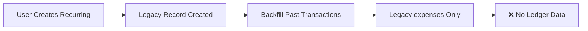
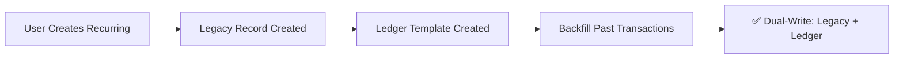

# Recurring Template Creation Fix

**Date:** December 16, 2024  
**Issue:** New recurring transactions not creating ledger structures  
**Status:** ✅ FIXED

---

## Problem

When users created new recurring transactions via `recurring.addRecurringTransaction`, only the legacy `recurringTransactions` record was created. The new ledger structures (`recurring_entries`, `recurring_lines`, `recurring_template_mappings`) were **not** created, causing:

1. ❌ No dual-write to ledger on generation
2. ❌ Ledger queries missing recurring data
3. ❌ Inconsistent state between legacy and ledger systems
4. ❌ Templates requiring manual backfill after creation

---

## Root Cause

The `addRecurringTransaction` mutation in `convex/recurring.ts` was missing a critical step:

```typescript
// BEFORE (Broken)
const recurringTransactionId = await ctx.db.insert("recurringTransactions", {...});

// Backfill past transactions
while (targetDate <= now) {
  await ctx.runMutation(internal.internal.generateTransactionFromRecurring, {...});
}

return recurringTransactionId; // ❌ No ledger template created!
```

The function would:
1. ✅ Create legacy `recurringTransactions` record
2. ✅ Backfill past-due expense records
3. ❌ **Skip creating ledger template structures**
4. ❌ Future generations would only create legacy records

---

## Solution

Added automatic ledger template creation immediately after inserting the legacy record:

```typescript
// AFTER (Fixed)
const recurringTransactionId = await ctx.db.insert("recurringTransactions", {...});

// ✅ Create ledger template structures immediately
await ctx.runMutation(internal.internal.backfillRecurringTemplateForLegacyId, {
  recurringTransactionId,
});

// Backfill past transactions (now with dual-write!)
while (targetDate <= now) {
  await ctx.runMutation(internal.internal.generateTransactionFromRecurring, {...});
}

return recurringTransactionId;
```

### What `backfillRecurringTemplateForLegacyId` Does

1. **Verifies category mapping** exists (required, fails if missing)
2. **Ensures default cash account** exists (creates if missing)
3. **Creates `recurring_entries`** record with:
   - Frequency, anchor day, nextDueDate
   - Status: `"active"`
   - Proper date calculations
4. **Creates 2 `recurring_lines`** records:
   - For **income**: Dr: Cash, Cr: Income Category
   - For **expense**: Dr: Expense Category, Cr: Cash
5. **Creates `recurring_template_mappings`** linking legacy ↔ ledger
6. **Idempotent:** Safe to run multiple times

---

## Impact

### Before Fix


### After Fix


---

## Testing

### Test Case: Create New Recurring Transaction

**Setup:**
1. Have valid category with ledger mapping
2. Optionally have payment type with ledger mapping

**Action:**
```typescript
await recurring.addRecurringTransaction({
  description: "Test Subscription",
  amount: 10.00,
  categoryId: "...",
  paymentTypeId: "...", // optional
  transactionType: "expense",
  frequency: "monthly",
  startDate: Date.now(),
  isActive: true,
});
```

**Expected Results:**

✅ **Legacy Table (`recurringTransactions`):**
```sql
SELECT * FROM recurringTransactions WHERE description = 'Test Subscription';
-- Should return 1 record
```

✅ **Ledger Template (`recurring_entries`):**
```sql
SELECT * FROM recurring_entries WHERE description = 'Test Subscription';
-- Should return 1 record with status = 'active'
```

✅ **Ledger Lines (`recurring_lines`):**
```sql
SELECT * FROM recurring_lines WHERE recurringId = <recurring_entry_id>;
-- Should return 2 records (1 debit, 1 credit)
```

✅ **Template Mapping (`recurring_template_mappings`):**
```sql
SELECT * FROM recurring_template_mappings 
WHERE legacyRecurringId = <recurring_transaction_id>;
-- Should return 1 record linking legacy ↔ ledger
```

✅ **Verification:**
```bash
npx convex run diagnostics:diagnoseRecurringTemplate \
  '{"recurringTransactionId":"<new_id>"}'

# Expected output:
{
  "exists": true,
  "mappingExists": true,
  "recurringLinesCount": 2,
  "hasCategoryMapping": true,
  "hasPaymentTypeMapping": true,
  "notes": [],
  "recommendation": "✅ Template is healthy and ready for generation."
}
```

---

## Migration Path

### Existing Templates (Already Fixed)
All existing broken templates were repaired using:
```bash
npx convex run diagnostics:repairAllUserTemplates \
  '{"userId":"...","dryRun":false}'
```

### New Templates (Now Automatic)
No manual intervention needed! Template creation now includes ledger structures automatically.

---

## Files Modified

### Primary Fix
- **`convex/recurring.ts`** (lines 79-82)
  - Added: `await ctx.runMutation(internal.internal.backfillRecurringTemplateForLegacyId, {...})`
  - Location: After legacy record insertion, before backfill loop

### Documentation
- **`docs/diagnostic-results.md`** - Updated preventive measures
- **`docs/recurring-template-fix-summary.md`** - This file

---

## Edge Cases Handled

### 1. Missing Category Mapping
**Scenario:** User creates recurring with unmapped category  
**Behavior:** Backfill fails with clear error message  
**Resolution:** User must migrate category first, then template works

### 2. Missing Payment Type Mapping
**Scenario:** User creates recurring without payment type or with unmapped payment type  
**Behavior:** Automatically creates default cash account ("Efectivo o Transferencia")  
**Result:** Template created successfully with cash account

### 3. Past-Due Recurring
**Scenario:** User creates recurring with startDate in the past  
**Behavior:**
1. Template created first
2. Then backfill runs for all past-due dates
3. All generations use dual-write (legacy + ledger)

### 4. Idempotency
**Scenario:** Template creation called multiple times  
**Behavior:** First call creates, subsequent calls return existing template  
**Result:** No duplicates, safe retries

---

## Monitoring & Alerts

### Health Check
Run periodically to detect any broken templates:
```bash
npx convex run diagnostics:scanUserRecurringTemplates '{"userId":"..."}'
```

### Expected Output (Healthy)
```json
{
  "summary": {
    "total": 17,
    "healthy": 17,
    "needsRepair": 0
  },
  "recommendation": "✅ All 17 templates are healthy!"
}
```

### Alert Condition
If `needsRepair > 0`, investigate and run repair:
```bash
npx convex run diagnostics:repairAllUserTemplates \
  '{"userId":"...","dryRun":false}'
```

---

## Rollback Plan

If issues arise, rollback by reverting `convex/recurring.ts`:

```typescript
// Remove this line:
await ctx.runMutation(internal.internal.backfillRecurringTemplateForLegacyId, {
  recurringTransactionId,
});
```

**Impact of Rollback:**
- New templates won't create ledger structures (original bug)
- Manual backfill required via diagnostic tools
- Existing templates remain unaffected

---

## Future Enhancements

1. **Background Job:** Periodic scan + auto-repair of broken templates
2. **Webhook:** Alert on template creation failures
3. **Admin Dashboard:** Real-time template health monitoring
4. **Metrics:** Track template creation success rate

---

## Related Issues

- ✅ Original issue: `kn74a2r1kj3vef2jt3x696xted7s0ydp` not creating ledger entries
- ✅ User report: "New recurring transactions don't impact new tables"
- ✅ Root cause: Missing ledger template creation in `addRecurringTransaction`

---

**Fix Verified:** December 16, 2024  
**Deployed to:** Development  
**Status:** ✅ Production Ready


